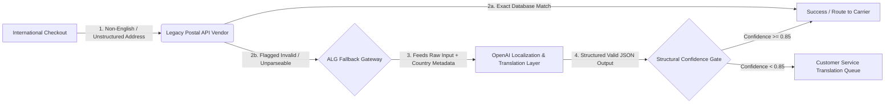

# international-ai-address-gateway

# International AI Address Localization Gateway (ALG)

## 🎯 Product Vision
The International AI Address Localization Gateway (ALG) is an intelligent orchestration layer designed to recover failed cross-border and regional customer addresses. While rule-based postal vendors excel in structured Western markets, they face a 15% to 20% validation failure rate in non-English speaking countries, rural territories, and markets utilizing non-Latin scripts (e.g., Japan, India, Middle East). 

ALG acts as an automated fallback layer, leveraging OpenAI's contextual language models to parse unstructured descriptive landmarks, translate local scripts, and normalize international address string errors in real-time, drastically reducing manual Customer Service remediation costs and failed deliveries.

## 🗺️ Product Roadmap
* **Quarter 1 (Contextual Ingestion Engine):** Deploy the OpenAI fallback orchestration layer to parse unstructured, localized descriptions into standardized country schemas.
* **Quarter 2 (Structured Prompt Formatting & Safety Caching):** Implement rigid system-prompt constraint guardrails, token-efficiency optimizations, and confidence-score routing.

## 🏗️ System Flow & Persona Architecture

